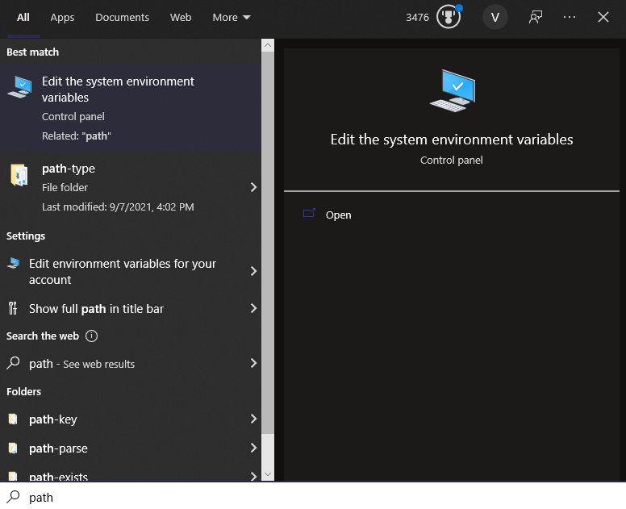
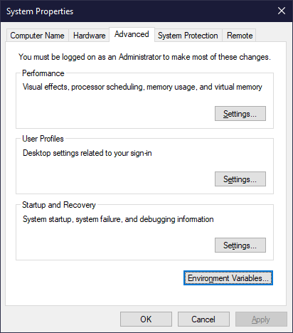
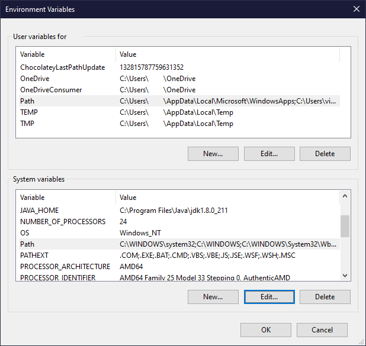
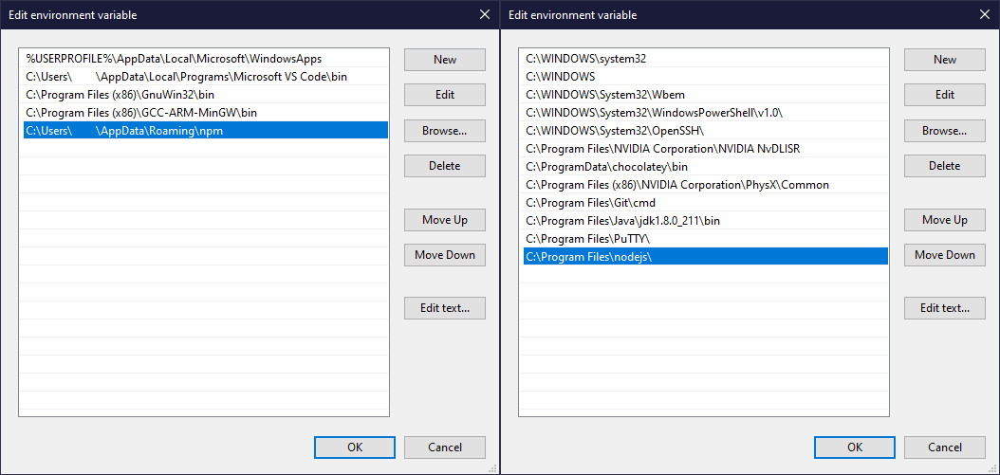
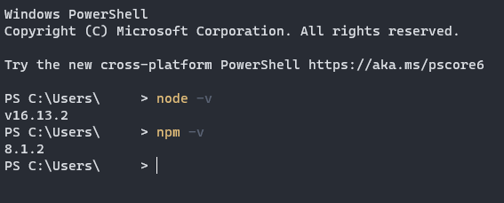

# Setup Guide for NodeJS and NPM

We'll start by setting up NodeJS and NPM. First, you need to
[install NodeJS](https://nodejs.org/en/).

Make sure you install the LTS version. As of now, this is 16.13.2; It will
change in the future.

## What about MacOS?

There's an installer [here](https://nodejs.org/en/download/).

Alternatively, you can install NodeJS via Homebrew (if you're comfortable with
it.) To do so, run the following command in a command prompt:

```
brew install node
```

## Ensuring your NodeJS installation is within the PATH

In Windows, installation of command tools can be a bit tricky. A lot of tools
won't properly add themselves to the PATH.

If you already got a choice in the installer to add NodeJS to PATH, it's still a
good idea to verify this. First, click on the Windows button (or press the
Windows key) and type `path`:



From there, click on `Edit the system environment variables`. This should open
Control Panel's environment variables tool.



Then, click on `Environment Variables...` in the bottom.



For those of you who have taken CMPSC 311, you'll remember that programs are
allowed to execute if they are in your operating system's PATH. These are those
PATH variables. Specifically, they're categorized into two sections:

-   Variables specified to your User account;
-   Variables for the entire system.

Generally, variables for the entire system will be applied to your user account
unless overwritten in your user account. I've highlighted both PATH variables in
the top and bottom (so you can find them easily.)

You want to ensure that your installation of NodeJS (wherever you put it) is
linked in the environment variables in either section (as designated in the
image below). You can see these by clicking `Edit...` for either section.

**NOTE! Do NOT modify things here unless you know what they are.**



On the left, I have my _User_ environment variables. We can see that `npm` is
highlighted here - That is our package manager, which we will be using to
install packages in the future.

On the right, I have my _System_ environment variables. We can see that `nodejs`
is highlighted here. This is our compiler.

Note that a lot of the `bin` folders are placed here - In Windows, PATH is a
lookup table for common binaries of programs. This allows these programs to be
used in any command prompt.

Both the ordering and placement of environment variables doesn't matter.
Depending on how much you install, the list might grow extremely long - There is
a length limit for these lists, but we don't have to worry about that for now.

Once you've ensured your environment variables are in place, press `OK` and
leave.

## Did my Node installation work?

You can check whether your NodeJS installation was successful or not via the
command line. Simply open any command prompt and type:

```
node -v
npm -v
```



You should get back SOMETHING. If you don't get back ANYTHING, you might want to
try restarting from step 1 and installing from scratch.

## Optional: Install Chocolatey

Any prior MacOS programmers will know of the existence of Homebrew, which allows
for easy software and package installation strictly through the command line.
Any Linux programmers will know about APT and Snap, which does the same thing.

Windows has a similar utility to this - Called Chocolatey. I consider it to be
extremely valuable, as it streamlines installation of all kinds of programming
tools, but it's purely optional.

There's a guide on how to set it up [here](https://chocolatey.org/install).

Make sure you check your environment variables afterwards!

Using chocolatey, we can simply open a command prompt **in administrator mode**
and type:

```
choco install nodejs-lts
```

That's it! Node will automatically be installed AND added to your PATH.
